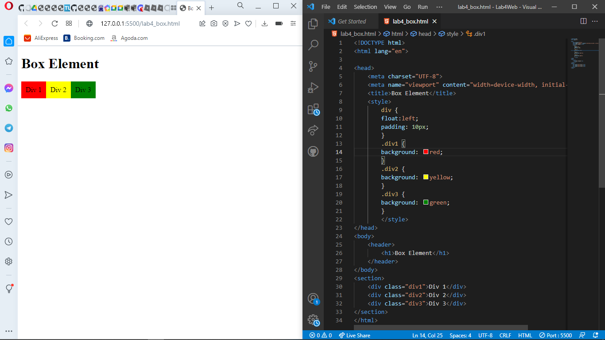
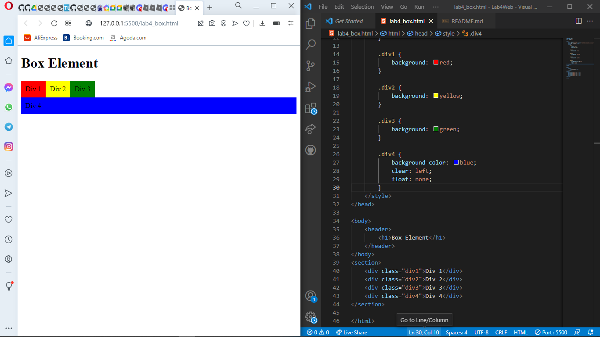

| Devi Silma Yuniar     | 312010458         |
|---------------------- |-------------------|
|TI.20.A.2              | Pemrograman Web   |

## LAB 4 WEB

## 1). MEMBUAT BOX ELEMENT


***penjelasan***

Disini telah dibuat box element dengan tag div dan juga dengan **CSS FLOAT PROPERTFY** .
```html
section>
    <div class="div1">Div 1</div>
    <div class="div2">Div 2</div>
    <div class="div3">Div 3</div>
</section>
```
```css
<style>
        div {
            float: left;
            padding: 10px;
        }

        .div1 {
            background: red;
        }

        .div2 {
            background: yellow;
        }

        .div3 {
            background: green;
        }
    </style>
```

## 2).MENGATUR CLEARFIX ELEMENT


***penjelasan***

Menambahkan element tag div dan juga css clear yang kemudian float nya di none.

```html
<div class="div4">Div 4</div>
````

```css
.div4{
           background-color: blue;
           clear: left;
           float: none;
       }
```